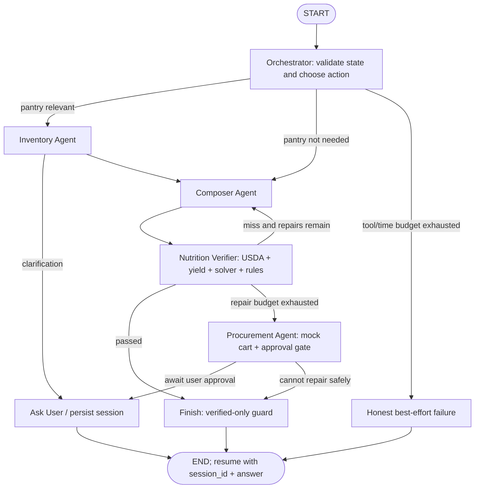

# Agentic Meal & Macro Planner for Alexa+

Python starter scaffold for the architecture in `agentic-meal-macro-architecture.md`. It provides the Alexa+-facing MCP surface, shared Pydantic contracts, specialist boundaries, deterministic macro arithmetic, a completion guard, and a mock-only retailer adapter.

## Current status

The orchestrator is implemented as a cyclic LangGraph `StateGraph`: an orchestrator router chooses inventory, composition, verification, procurement, clarification, or finish nodes; a failed verification loops through composition and verification again, with repair/tool/time limits enforced in code. It can skip inventory when appropriate, resumes clarification sessions, persists graph checkpoints plus plan/session snapshots to local SQLite, and rejects completion unless deterministic verification passed. Its Ollama action router and receipt vision parser are opt-in with `ENABLE_ORCHESTRATOR_LLM=true` and `OLLAMA_API_KEY`; otherwise a state-aware fallback policy and recipe search are used. To resume a clarification, pass the returned `session_id` and user's `answer` back to `plan_meal`.

State is split across LangGraph working-state checkpoints, durable SQLite user/domain/plan tables, and an optional Redis session cache (`REDIS_URL`, default 24-hour `SESSION_TTL_SECONDS`). Verified or pending-approval portions that match measured stock are reserved per user/plan with six-hour expiry. Agent actions are appended to SQLite tool traces with sensitive token fields redacted. Taste feedback can be recorded via `nutrition_status(action="feedback", preference="spicy", liked=true)` and is supplied to the composer.

The inventory agent supports SQLite CRUD/audit, reservations that expire after six hours, consumption, voice parsing with uncertainty questions, optional receipt-image parsing, barcode nutrition lookup, and expiry checks. Nutrition uses USDA FoodData Central first (API key from `USDA_API_KEY`) with a 30-day SQLite cache and Open Food Facts fallback, plus SciPy/HiGHS portion solving, Atwater consistency warnings, deterministic yield/diet checks, and re-verification after rounding. Optional Neo4j facts and diet/allergen/substitution/yield relationships are wired through `meal_agent/kg/neo4j_store.py`; see [meal_agent/kg/README.md](meal_agent/kg/README.md). The composer can search TheMealDB and use the opt-in LLM to propose candidates without macro claims. Tracking stores daily goals, verified meal logs, and decrements measured inventory. Procurement is connected to a clearly fake local catalog, budget/approval/audit/idempotency guards, and never sends an order to a real retailer.

Alexa+ account linking is not implemented; local requests use `MEAL_AGENT_USER_ID` and must not be exposed publicly. There is no live retailer adapter or real checkout.

The existing `services/LLMs.py` is the optional router/composer/receipt-vision model client; LLM output only chooses a next action or proposes candidate text. Nutrition facts and final macro totals come from USDA/Open Food Facts and deterministic verification. Workflow/domain state defaults to `data/meal-agent.sqlite3` and is keyed by user, but the default `local-demo-user` is for local development only.

## MCP tool contract

The server registers exactly four goal-level tools: `plan_meal`, `manage_inventory`, `shop_for_meal`, and `nutrition_status`. Each tool has a typed input schema, a typed structured output, a concise `spoken_summary`, and a `resourceUri`; its MCP Apps metadata points to the same registered `ui://` resource. `plan_meal.target` supports exact macros (such as `kcal`) and bounds (such as `protein_g_min` or `carbs_g_max`).

Tools return `not_configured` when an external provider or store is unavailable, and never invent nutrition values. A `verified` result must be backed by a passing deterministic verification. The HTML resources are display-only shells, and the server currently uses a local demo user rather than Alexa+ account linking; do not expose this scaffold publicly until authentication and per-user isolation are implemented.



## Run locally with uv

Start the server over Streamable HTTP:

```sh
uv run python -m meal_agent.server --transport streamable-http
```

The HTTP endpoint is `http://127.0.0.1:8000/mcp` by default. Keep the server running, then launch MCP Inspector separately and select **Streamable HTTP** with that URL. VS Code's [MCP configuration](.vscode/mcp.json) also connects using HTTP. The server reads `HOST`, `PORT`, and `APP_NAME` from the environment. USDA reads `USDA_API_KEY`; Neo4j reads `NEO4J_URI`, `NEO4J_USERNAME`, `NEO4J_PASSWORD`, and `NEO4J_DATABASE`. Never commit or print credentials. Copy `.env.example` for variable names and enter credentials locally. Set `ENABLE_ORCHESTRATOR_LLM=true` to turn on Ollama routing/composition and receipt vision. Remote Alexa+ deployment needs public HTTPS plus authentication/account linking.

## Tests

```sh
uv run python -m unittest discover -s tests
```

## Layout

- `meal_agent/server.py` — goal-level FastMCP tools.
- `meal_agent/graph/` — compiled LangGraph `StateGraph`, routing decisions, specialist toolbox, completion gate, and typed request state.
- `meal_agent/storage/workflow_store.py` — SQLite session/plan/context persistence for the MVP.
- `meal_agent/agents/` — inventory, composer, verifier, and procurement boundaries.
- `meal_agent/tools/` — deterministic macro calculations and solver boundary.
- `meal_agent/tools/food_data.py` — USDA FoodData Central/Open Food Facts client and local cache.
- `meal_agent/kg/neo4j_store.py` — optional Neo4j driver adapter for nutrition profiles and knowledge-graph rules.
- `meal_agent/storage/domain_store.py` — SQLite inventory, profiles, nutrition logs, approvals, carts, orders, and audit events.
- `meal_agent/adapters/retail/` — retailer protocol and safe mock adapter.
- `services/LLMs.py` — existing Ollama client setup.
- `tests/` — built-in `unittest` checks for arithmetic and verification guards.

## Next implementation milestones

1. Add Alexa+ account linking and authenticated per-user identity; replace the local demo ID.
2. Expand curated nutrition/yield/allergen data and evaluate provider licensing/coverage.
3. Replace the mock catalog with an approved retailer adapter only after purchase authorization requirements are met.
4. Add expiry cleanup/background jobs, observability, and operational database backups.
5. Connect display-only HTML shells to an interactive MCP Apps bridge and trusted host-side approval signal.
