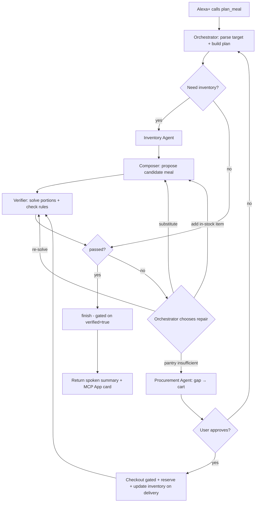

# Agentic Meal & Macro Planner for Alexa+ — Architecture & Design

> Goal: a Python agentic system, reachable from Alexa+ through an MCP server, that knows the user's food inventory, builds meals that hit an exact calorie/macro target from that inventory, buys what is missing (with approval), and **verifies** the macros before it answers.

---

## 1. The idea in one paragraph

The user says something like *"I need a 600-calorie dinner with at least 45 g protein"* or *"I have 700 kcal left today, 60 g protein, under 30 g carbs — what can I make?"*. The system looks at what is actually in the kitchen, invents a meal, **computes** (not guesses) its macros, repairs it if it misses the target, and if the pantry genuinely can't satisfy the goal it finds the cheapest/best missing items, builds a cart and asks for approval before purchasing. After cooking, the inventory is decremented and the day's macro budget is updated.

---

## 2. Why this is agentic and not a pipeline

### 2.1 Definitions

| | Pipeline (workflow) | Agentic system |
|---|---|---|
| Control flow | Fixed in code: A → B → C | Decided at runtime by an LLM |
| Tool use | Every tool called every time | Agent *chooses* which tool, when, and with what arguments |
| Failure | Crashes or returns bad output | Observes the failure, re-plans, tries another strategy |
| Termination | After last step | When the goal's success criteria are met (or budget exhausted) |
| State | Passed along | Persistent, used to decide next action |

### 2.2 Where the decisions are (this is what makes it agentic)

1. **Does it need the inventory at all?** "Log my lunch" → skip inventory, go straight to tracking. "What can I cook?" → inventory first.
2. **Is the pantry enough?** Inventory sufficient → skip Procurement entirely. Insufficient → go to Procurement.
3. **Macros missed — which repair strategy?** The verifier says "protein short by 18 g". The orchestrator chooses between: (a) re-solve portions, (b) substitute an ingredient, (c) add an in-stock side, (d) buy something. It prefers cheaper/no-purchase options first.
4. **Which products to buy?** The procurement agent compares products by price, macro-fit, pack size, waste, and user brand preferences.
5. **Ask or act?** It asks a clarifying question only when an ambiguity changes the outcome (e.g. "is the chicken raw or cooked?"), otherwise proceeds.
6. **Re-planning mid-flight.** If a product is out of stock or the user rejects the cart, the plan is revised, not restarted.

### 2.3 What is deliberately *not* an agent

A senior-engineer rule: **use an agent only where the next step is unknown in advance; use a deterministic tool everywhere correctness matters.**

- Macro arithmetic, unit conversion, portion optimization, allergen rule checks → **deterministic tools** (LLMs are unreliable at arithmetic and at remembering nutrition facts).
- Checkout → **guarded tool** (hard-coded approval + budget cap), never "the LLM decided".

This split (LLM proposes → symbolic tools verify) is also the neurosymbolic part of the design; it mirrors the claim-verification idea of KGVS: treat "this meal has 46 g protein" as a *claim* and verify it against a structured knowledge source instead of trusting the model.

---

## 3. Agentic design pattern chosen

A **composition** of well-known patterns, each used where it fits:

| Pattern | Where used | Why |
|---|---|---|
| **Orchestrator–Workers (Supervisor)** | Top level: 1 orchestrator delegating to 4 specialists | Clear responsibility, controllable, debuggable |
| **Agents-as-tools** | Orchestrator calls specialists like tools and keeps control | More predictable than free-form handoffs; easy to enforce budgets |
| **ReAct (reason → act → observe)** | Inside every specialist | Lets each specialist pick its own tools in a loop |
| **Plan-and-Execute with re-planning** | Orchestrator | Builds an explicit task plan, updates it on observations |
| **Evaluator–Optimizer (generate → verify → repair)** | Composer ⇄ Verifier loop | Guarantees the final meal meets the macro target |
| **Human-in-the-loop gate** | Before any purchase | Safety for actions with real-world side effects |
| **Neurosymbolic grounding** | Verifier (solver + knowledge graph) | Facts and math come from symbols, creativity from the LLM |

**Why not a fully autonomous swarm / free-for-all multi-agent chat?** Voice assistants need low latency and predictability. Too many agents talking = slow, costly, and hard to bound. A supervisor with bounded specialists gives agency *and* control.

---

## 4. Two levels of agency (important for Alexa+)

Alexa+ is itself an LLM-driven client that chooses among the MCP tools you expose. So there are **two** agentic layers:

```
OUTER agent : Alexa+  ── picks which of YOUR MCP tools to call (you don't control this)
INNER agents: YOUR system ── each MCP tool is backed by a multi-agent workflow you control
```

Design consequence: expose **few, goal-level tools** with excellent descriptions (what Alexa+ sees when it decides), not dozens of low-level CRUD tools. All the fine-grained tool choice happens *inside* your system.

---

## 5. High-level architecture

```
                         ┌────────────────────────────────────────────┐
  User voice / screen    │                  ALEXA+                    │
  "600 kcal, 45 g protein│  (NLU, dialog, renders cards / MCP Apps)   │
   dinner"               └───────────────────┬────────────────────────┘
                                             │  MCP (Streamable HTTP)
                                             ▼
┌───────────────────────────────────────────────────────────────────────────────┐
│                     MCP SERVER  (Python, FastMCP)                             │
│  auth · account linking → user_id · schema validation · rate limits           │
│                                                                               │
│  MCP tools (goal-level):                                                      │
│   plan_meal · manage_inventory · shop_for_meal · nutrition_status             │
│  MCP resources: ui://meal-card · ui://cart-approval  (MCP Apps)               │
└───────────────────────────────────────┬───────────────────────────────────────┘
                                        ▼
┌───────────────────────────────────────────────────────────────────────────────┐
│                 AGENT RUNTIME  (LangGraph supervisor graph)                   │
│                                                                               │
│                      ┌───────────────────────┐                                │
│                      │  ORCHESTRATOR AGENT   │  plan · delegate · re-plan     │
│                      └───┬────┬────┬────┬────┘  · ask_user · finish(gated)    │
│           ┌──────────────┘    │    │    └───────────────┐                    │
│           ▼                   ▼    ▼                    ▼                    │
│   ┌──────────────┐  ┌──────────────┐ ┌───────────────┐ ┌────────────────┐    │
│   │  INVENTORY   │  │   CULINARY   │ │   NUTRITION   │ │  PROCUREMENT   │    │
│   │    AGENT     │  │   COMPOSER   │ │   VERIFIER    │ │     AGENT      │    │
│   │ (ReAct)      │  │   (ReAct)    │ │ (ReAct+solver)│ │ (ReAct + HITL) │    │
│   └──────┬───────┘  └──────┬───────┘ └───────┬───────┘ └───────┬────────┘    │
└──────────┼─────────────────┼─────────────────┼─────────────────┼─────────────┘
           ▼                 ▼                 ▼                 ▼
   ┌──────────────┐  ┌──────────────┐ ┌────────────────┐ ┌────────────────┐
   │ Postgres     │  │ Recipe store │ │ Nutrition DBs  │ │ Retailer       │
   │ inventory,   │  │ + substitution│ │ (USDA FDC,     │ │ adapters       │
   │ profile,     │  │ knowledge    │ │ Open Food Facts│ │ (mock / real)  │
   │ history      │  │ graph        │ │ ) + KG + LP    │ │ cart/checkout  │
   └──────────────┘  └──────────────┘ └────────────────┘ └────────────────┘
           ▲
   Redis (session & working state) · Langfuse/OpenTelemetry (traces)
```

---

## 6. How many agents? → **5** (1 orchestrator + 4 specialists)

Split by **distinct toolset, distinct risk level, and distinct model cost** — not by "one agent per noun".

| # | Agent | Responsibility | Risk | Model tier |
|---|---|---|---|---|
| 1 | **Orchestrator** | Understand goal, build/modify plan, delegate, decide repair strategy, decide when done | Medium | Strong |
| 2 | **Inventory Agent** | Know what the user has: read, update, reserve, reason about quantity/expiry uncertainty | Low | Small/fast |
| 3 | **Culinary Composer** | Creative: propose meals & substitutions from inventory, respect taste/diet | Low | Strong |
| 4 | **Nutrition Verifier** | Truth: compute macros, solve portions, check rules, produce pass/fail + *what's wrong* | Low (but critical) | Small (mostly tool calls) |
| 5 | **Procurement Agent** | Compute gap, search/compare products, build cart, request approval, (gated) checkout | **High** | Medium |

**Why not fewer?** Merging Composer and Verifier destroys the evaluator–optimizer separation (the generator would grade its own homework). Merging Procurement into anything else mixes a high-risk side-effect toolset with low-risk reasoning.

**Why not more?** Every extra agent adds latency and failure modes. A "Preferences agent" or "UI agent" would just be a DB read / a template — keep those as plain services.

**Hackathon/MVP cut:** Orchestrator + Inventory + Composer + Verifier (real), Procurement against a **mock retailer adapter** (real adapter later).

---

## 7. Agents in detail

### 7.1 Orchestrator Agent
- **Input:** raw request (from MCP tool args), user profile, today's macro status, session state.
- **Produces:** a structured `NutritionTarget`, an explicit **plan** (task list it edits as it learns), and finally a verified `MealPlan`.
- **Decisions it makes:** which specialist next, whether to skip steps, which repair strategy, when to ask the user, when to stop.
- **Tools:** `call_inventory_agent`, `call_composer_agent`, `call_verifier_agent`, `call_procurement_agent`, `get_session_state`, `ask_user`, `save_plan`, `finish`.
- **Hard guardrail in code:** `finish()` **rejects** any meal whose `verification.passed` is false. The "verified before answering" requirement is enforced by code, not by prompt.
- **Budgets:** max N repair iterations (e.g. 4), max tool calls, max wall-clock time; on exhaustion it returns the *best verified-closest* meal plus an honest explanation of the gap.

### 7.2 Inventory Agent
- **Goal:** answer "what do I have, how much, what's expiring, what's reserved?" and keep the state correct.
- **Why it's an agent (not a SQL query):** inventory is **uncertain, messy state** — "a bag of rice", "some chicken", receipts in photos, voice updates in free text, units in cups vs grams. It must reason and ask when needed.
- **Tools:** `inventory_list`, `inventory_upsert`, `inventory_consume`, `inventory_reserve`, `expiring_soon`, `normalize_units`, `parse_receipt` (vision), `parse_utterance`, `lookup_barcode`.
- **How the inventory is populated (the real-world hard part):**
  1. Voice: "I bought 1 kg chicken and a dozen eggs."
  2. Receipt/photo parsing (vision model → structured items).
  3. Barcode lookup (Open Food Facts).
  4. **Closed loop:** anything bought through this system is auto-added on delivery; anything cooked is auto-consumed.
  5. Optional connectors later (order history, etc.) — treat as a bonus, not an assumption.
- Each row stores `quantity`, `unit`, `grams_estimate`, `confidence`, `expiry`, `source`, `last_confirmed_at`. Low-confidence items are flagged so the orchestrator can ask.

### 7.3 Culinary Composer Agent
- **Goal:** propose *candidate* meals that are plausible, tasty, use in-stock (especially expiring) items, and respect diet/allergy/preferences.
- **Output:** `CandidateMeal` = list of `(ingredient, role, min_g, max_g)` + cooking method + short instructions. **It does not output final grams or macros** — that is the Verifier's job. (Prevents the LLM from hallucinating numbers.)
- **Tools:** `search_recipes`, `suggest_substitutions` (knowledge graph), `get_user_profile`, `get_meal_history` (avoid repeats), `cooking_yield_rules`.
- **Strategy choices it makes:** build from expiring items, adapt a known recipe, or freestyle from macro-dense ingredients (protein anchor + carb base + fat source + veg).

### 7.4 Nutrition Verifier (neurosymbolic core)
- **Goal:** turn a candidate meal into exact portions and verified macros, or explain precisely why it can't.
- **Tools:**
  - `nutrition_lookup(food)` — per-100 g values from USDA FoodData Central / Open Food Facts (cached).
  - `apply_yield_factors(food, method)` — raw vs cooked weights (a classic source of big macro errors).
  - `solve_portions(items, targets, constraints)` — LP/CP solver (Section 9).
  - `compute_macros(meal)` — deterministic sum.
  - `kg_check_rules(meal, profile)` — allergens, diet rules (vegetarian, halal, etc.), culinary constraints via the knowledge graph.
  - `verify_claim(claim)` — KGVS-style: any numeric macro claim in the text is re-derived and compared.
- **Output (this is the agentic feedback signal):**
  ```json
  {
    "passed": false,
    "totals": {"kcal": 694, "protein": 42, "carbs": 28, "fat": 31},
    "deviation": {"protein": -18, "kcal": -6},
    "violations": [],
    "missing_capacity": {"protein_g": 18},
    "suggestions": ["add ~80 g high-protein item", "reduce fat source by 10 g"]
  }
  ```
  The Orchestrator reads `deviation` / `missing_capacity` and **chooses** the repair strategy.

### 7.5 Procurement Agent
- **Goal:** close the gap between "what the meal needs" and "what's in stock" at the best cost/fit, safely.
- **Tools:** `compute_gap`, `product_search`, `price_compare`, `score_product`, `cart_build`, `cart_update`, `request_approval`, `checkout` (**gated**), `order_status`.
- **Decisions it makes:** which retailer/product, pack-size vs waste trade-off ("buy 500 g pack to use 120 g?" → prefer items that also serve other likely meals), substitutions if out of stock.
- **Safety model (enforced in code):**
  - `checkout` requires a valid **approval token** produced only by an explicit user confirmation (voice "yes, order it" or tap in the MCP App).
  - Per-order and per-day **budget caps**.
  - **Idempotency key** per cart so a retried call can't double-order.
  - Cart is **re-verified** after product substitution (macros may change).
  - Full audit log of every purchase decision.
- **Adapter pattern:** `RetailerAdapter` interface with `MockRetailer` (demo/tests) and real implementations behind it. The agent never knows which one it's talking to.

---

## 8. The MCP tool surface (what Alexa+ sees)

Keep it small; descriptions are written for Alexa+'s LLM (when to use, what to pass).

| MCP tool | Example utterance | Internally runs |
|---|---|---|
| `plan_meal(target, meal_type?, constraints?)` | "Make me a 600-calorie dinner with 45 g protein" | Full orchestrator loop (inventory → compose → verify → repair → optional procurement) |
| `manage_inventory(action, free_text?, image?)` | "I bought chicken and eggs" / "What's expiring?" | Inventory agent |
| `shop_for_meal(plan_id, confirm?)` | "Order the missing ingredients" / "Yes, place the order" | Procurement agent (approval-gated) |
| `nutrition_status(action)` | "What macros do I have left today?" / "Log that meal" | Tracking service + Verifier |

Each tool returns:
1. **Structured content** (machine-readable result).
2. A short **spoken summary** (1–2 sentences — voice first).
3. A **`resourceUri`** pointing to an MCP App UI (meal card with macro ring, ingredient list with stock/missing badges, cart-approval button) — Alexa+ falls back to rendering the data-only result if there is no custom UI.

State that survives between calls (so "yes, order it" works a minute later or tomorrow): `plan_id` persisted in Postgres, keyed by `user_id`.

---

## 9. Macro verification & the portion solver

### 9.1 Facts
- Energy check (Atwater): `kcal ≈ 4·protein + 4·carbs + 9·fat` — useful as a consistency test on both targets and results.
- Sources of error to handle explicitly: raw vs cooked weight, oil absorbed while cooking, label rounding, unit density (cups → grams).
- Tolerance is configurable (default ±5 % per constrained macro, ±1 g floor for small numbers).

### 9.2 LP formulation
Variables: grams `x_i` of each candidate ingredient, plus over/under slack per constrained nutrient.

```
minimize   Σ_k  w_k/T_k · (over_k + under_k)            # miss the target as little as possible
         + λ · Σ_{i not in stock} cost_i · x_i          # prefer not to buy
subject to Σ_i a_{ik} x_i − over_k + under_k = T_k      # for each constrained nutrient k
           min_i ≤ x_i ≤ max_i                          # portion sanity; max_i = stock for in-stock items
           over_k, under_k ≥ 0
```
`a_ik` = nutrient k per gram of ingredient i. Unconstrained nutrients are simply left out.

Because slack variables make the LP always feasible, the **slack values are the signal**: `under_protein = 18` means "this ingredient set can't reach the protein target from current stock" → that, not a crash, tells the orchestrator to substitute or buy.

### 9.3 Reference implementation

```python
import numpy as np
from scipy.optimize import linprog

def solve_portions(items, targets, purchase_penalty=1.0, weights=None):
    """
    items:   list of dicts with per-GRAM values:
             {name, kcal, protein, carbs, fat, min_g, max_g, in_stock, cost_per_g}
    targets: {"kcal": 600, "protein": 45, "carbs": None, "fat": None}  (None = unconstrained)
    """
    keys = [k for k, v in targets.items() if v]
    n, m = len(items), len(keys)
    nv = n + 2 * m                      # [x..., over..., under...]

    c = np.zeros(nv)
    for j, k in enumerate(keys):
        w = (weights or {}).get(k, 1.0) / targets[k]
        c[n + j] = w                    # over
        c[n + m + j] = w                # under
    for i, it in enumerate(items):
        if not it["in_stock"]:
            c[i] += purchase_penalty * it["cost_per_g"]

    A_eq = np.zeros((m, nv))
    b_eq = np.zeros(m)
    for j, k in enumerate(keys):
        for i, it in enumerate(items):
            A_eq[j, i] = it[k]
        A_eq[j, n + j] = -1             # - over
        A_eq[j, n + m + j] = 1          # + under
        b_eq[j] = targets[k]

    bounds = [(it["min_g"], it["max_g"]) for it in items] + [(0, None)] * (2 * m)
    res = linprog(c, A_eq=A_eq, b_eq=b_eq, bounds=bounds, method="highs")
    if not res.success:
        return {"passed": False, "error": res.message}

    grams = {it["name"]: round(res.x[i] / 5) * 5 for i, it in enumerate(items)}  # round to 5 g
    # Recompute from ROUNDED grams — never trust the solver's pre-rounding totals
    totals = {k: sum(grams[it["name"]] * it[k] for it in items)
              for k in ("kcal", "protein", "carbs", "fat")}
    deviation = {k: totals[k] - targets[k] for k in keys}
    passed = all(abs(deviation[k]) <= max(0.05 * targets[k], 1) for k in keys)
    return {"passed": passed, "grams": grams, "totals": totals, "deviation": deviation}
```

For "at least X g protein" (inequality) targets, swap the equality row for `≥` and drop the `under` slack for that nutrient. For integer portions (e.g. whole eggs), use OR-Tools CP-SAT / MILP instead of plain LP.

### 9.4 Knowledge graph (neurosymbolic layer)
- **Nodes:** `Ingredient`, `NutrientProfile`, `Category`, `Allergen`, `Diet`, `CookingMethod`, `Product` (retail SKU).
- **Edges:** `HAS_PROFILE`, `CONTAINS_ALLERGEN`, `VIOLATES_DIET`, `SUBSTITUTES(ratio, caveat)`, `PAIRS_WELL_WITH`, `YIELD(method, factor)`.
- **Used for:** substitutions that preserve macros, allergen/diet hard constraints, yield factors, and verifying claims.
- **Tech:** NetworkX or Kùzu for the hackathon; Neo4j if it needs to scale.
- **Principle:** LLM = *proposal* (neural). KG + solver = *verification* (symbolic). The LLM is never the source of nutrition facts.

---

## 10. Execution flow



### Example trace (shows real tool *choice*)

Request: *"700 kcal, 60 g protein, under 30 g carbs."*

| Step | Who | Decision / action | Observation |
|---|---|---|---|
| 1 | Orchestrator | Parses target; plan = inventory → compose → verify | — |
| 2 | Inventory | `inventory_list`, `expiring_soon(3)` | Chicken 300 g, eggs 6, rice, spinach (expires in 2 d), olive oil, Greek yogurt 400 g |
| 3 | Composer | Builds from expiring spinach + protein anchor | Chicken + egg scramble + spinach + olive oil |
| 4 | Verifier | `solve_portions` | Best achievable protein 49 g → **under by 11 g** |
| 5 | Orchestrator | Chooses cheapest repair first: add in-stock item | Asks Composer to add Greek yogurt side |
| 6 | Verifier | Re-solve | 57 g protein → **still under by 3 g** (outside tolerance) |
| 7 | Orchestrator | In-stock options exhausted → Procurement | — |
| 8 | Procurement | `compute_gap` → `product_search("cottage cheese / protein powder")` → `score_product` | Picks one small-pack item that also fits tomorrow's likely meals |
| 9 | Orchestrator | `request_approval` | MCP App card: "Add 1 item, $X — approve?" |
| 10 | User | "Yes" | approval token issued |
| 11 | Procurement | `checkout(token, idempotency_key)` | Order placed; inventory updated on delivery |
| 12 | Verifier | Final verification incl. purchased item | **Passed** (−0.6 % kcal, −0.8 % protein) |
| 13 | Orchestrator | `finish()` (gate passes) | Spoken summary + card |

A pipeline would have run the same steps every time. Here steps 5–9 only happen *because* observations demanded them; with a richer pantry they would be skipped entirely.

---

## 11. State & memory

| Layer | What | Store |
|---|---|---|
| **Working state** (one request) | Current target, candidate meal, verification result, plan, counters | LangGraph state + checkpoint |
| **Session state** (minutes–hours) | Pending plan awaiting approval, last proposed meal, clarifications asked | Redis (TTL) |
| **Long-term user state** | Inventory, dietary profile, allergies, targets, brand/taste preferences, meal history, daily macro log, order history | Postgres |
| **Semantic memory** (optional) | "Likes spicy", "dislikes salmon", inferred from accept/reject behavior | Postgres + pgvector |
| **Knowledge** | Nutrition, substitutions, rules | DBs + knowledge graph |

Core tables: `users`, `inventory_items`, `inventory_events` (append-only audit), `meal_plans`, `meal_plan_items`, `macro_log`, `carts`, `orders`, `approvals`, `tool_call_traces`.

Reservation logic: when a plan is proposed, its in-stock ingredients are **reserved** (`inventory_reserve`) so two plans can't claim the same chicken; reservations expire if the plan is abandoned.

---

## 12. Frameworks & technology

### 12.1 Recommended stack

| Concern | Choice | Notes |
|---|---|---|
| Language | **Python 3.12** | As you planned |
| MCP server | **Official MCP Python SDK (FastMCP)**, Streamable HTTP | Alexa+ requires Streamable HTTP |
| Agent orchestration | **LangGraph** | Explicit stateful graph, cycles (the repair loop), checkpointing, interrupts for human approval |
| Agent "brains" | Tool-calling LLM; strong model for Orchestrator/Composer, small model for Inventory/Verifier | Bedrock-hosted models are a natural fit on AWS |
| Schemas / validation | **Pydantic v2** | Every tool input/output and agent handoff is typed |
| Solver | **SciPy `linprog` (HiGHS)** → **OR-Tools CP-SAT** when integer portions needed | Deterministic |
| Units | **pint** + ingredient density table | cups/tbsp/pieces → grams |
| DB | **PostgreSQL** (SQLite for the very first prototype) | + pgvector if semantic memory |
| Cache / session | **Redis** | |
| Knowledge graph | **NetworkX / Kùzu** → Neo4j | |
| Nutrition data | **USDA FoodData Central**, **Open Food Facts** | Check each license/terms and coverage for the foods your users eat |
| Vision (receipts) | Multimodal LLM with structured output | |
| Observability | **Langfuse** or OpenTelemetry | Trace every tool call — essential for debugging agents |
| Evaluation | Custom harness + pytest | Section 15 |
| Deploy | Container on AWS (ECS Fargate / App Runner) behind HTTPS | Needs a public remote URL |

### 12.2 Framework alternatives (and when I'd pick them)

| Framework | Strength | Pick it if |
|---|---|---|
| **LangGraph** *(recommended)* | Fine control of loops, state, human-in-the-loop, persistence | You want the repair loop + approval gate to be explicit and testable |
| **Strands Agents (AWS)** | Lightweight, model-driven loop, first-class Bedrock integration | You're building on AWS and want to hit an AWS-builder angle; the agent boundaries in this doc stay identical |
| **OpenAI Agents SDK** | Simple agents-as-tools & handoffs, guardrails | You're using OpenAI models and want minimal code |
| **PydanticAI** | Type-safe, clean for small agents | You value strict typing over graph control |
| **CrewAI / AutoGen-style** | Quick role-based multi-agent demos | Prototyping only; less control over termination and cost |

Keep the **agent/tool interfaces framework-agnostic** (plain Python functions + Pydantic models). Then switching LangGraph ↔ Strands is a wiring change, not a rewrite.

### 12.3 Minimal skeleton

```python
# server.py — MCP surface
from mcp.server.fastmcp import FastMCP
from graph.supervisor import run_plan_meal

mcp = FastMCP("meal-macro-agent", stateless_http=True)

@mcp.tool()
async def plan_meal(target: dict, meal_type: str | None = None,
                    constraints: dict | None = None) -> dict:
    """Plan a meal from the user's inventory that hits calorie/macro targets.
    Use when the user asks what to cook/eat with specific calories or macros.
    target example: {"kcal": 600, "protein_g_min": 45}"""
    user_id = current_user_id()          # from account-linking auth
    return await run_plan_meal(user_id, target, meal_type, constraints)

if __name__ == "__main__":
    mcp.run(transport="streamable-http")
```

```python
# graph/supervisor.py — orchestrator as a graph with an LLM-driven router
from langgraph.graph import StateGraph, END

class S(TypedDict):
    target: dict; inventory: dict; candidate: dict
    verification: dict; gap: dict; cart: dict
    plan: list; iterations: int; approval_token: str | None

def orchestrator(state: S) -> S:
    """LLM sees state + tool list, emits the NEXT action (not a fixed sequence)."""
    ...

def route(state: S) -> str:
    # The LLM-chosen action decides the edge; code only enforces budgets/guards
    if state["iterations"] > MAX_ITERS: return "finalize_best_effort"
    return state["next_action"]   # "inventory" | "compose" | "verify" | "procure" | "ask_user" | "finish"

g = StateGraph(S)
g.add_node("orchestrator", orchestrator)
for n in ("inventory", "compose", "verify", "procure", "ask_user", "finish"):
    g.add_node(n, globals()[f"{n}_node"])
    g.add_edge(n, "orchestrator")          # every specialist reports back to the supervisor
g.add_conditional_edges("orchestrator", route)
g.set_entry_point("orchestrator")
# interrupt_before=["procure_checkout"] gives the human-approval pause
```
(API names vary slightly between LangGraph versions — treat this as structure, not copy-paste.)

### 12.4 Suggested project layout

```
meal_agent/
├─ server.py                 # FastMCP app, auth, tool definitions
├─ graph/
│  └─ supervisor.py          # orchestrator graph, budgets, finish() gate
├─ agents/
│  ├─ inventory.py  composer.py  verifier.py  procurement.py
├─ tools/
│  ├─ inventory_tools.py  nutrition_tools.py  solver.py
│  ├─ kg_tools.py  retail_tools.py  units.py
├─ adapters/retail/          # base.py (interface), mock.py, real_*.py
├─ kg/                       # schema + loaders
├─ db/                       # models, migrations
├─ ui/                       # MCP App HTML resources (meal card, cart approval)
├─ evals/                    # scenarios, metrics, ablations
└─ tests/
```

---

## 13. Integrating with Alexa+

Facts from Amazon's Alexa+ MCP documentation (re-check before building — this evolves quickly):

- Alexa+ acts as the **MCP client**; your server exposes tools/resources/prompts. Supported MCP spec version is **2025-11-25**.
- Your server **must support Streamable HTTP** (legacy SSE must be migrated) and be reachable at a **remote URL**.
- You create an **Alexa+ MCP add-on** that bridges your server to Alexa+; onboarding uses the **Alexa AI CLI** (e.g. `alexa-ai new mcp ...`), and after changing tools you redeploy with `alexa-ai deploy`.
- **MCP Apps** extension is supported: if a tool response defines a `resourceUri`, Alexa+ renders your custom UI; otherwise it renders the data from the tool response.
- **Account linking** lets your server personalize results — this is how you get a stable `user_id` for inventory and history.

Voice-first design rules:
1. Spoken summary ≤ 2 sentences; put ingredient lists/macro rings on the card.
2. At most **one** clarifying question per turn, only when it changes the outcome.
3. Keep the happy path fast: deterministic solver, cached nutrition lookups, small models for Inventory/Verifier, parallel tool calls where independent.
4. Long operations (purchases, receipt parsing): return quickly with a status and provide a follow-up status path; check Alexa+'s tool-call timeout limits in the docs.
5. Purchases always confirmed explicitly (voice yes or tap), never implied.

---

## 14. Guardrails, failure handling, safety

| Risk | Mitigation |
|---|---|
| LLM invents nutrition numbers | Numbers only from tools; `finish()` rejects unverified meals |
| Wrong portions due to raw/cooked confusion | Yield factors + ask when ambiguous |
| Allergen / diet violation | KG hard constraints checked **before and after** any substitution; violation = automatic fail |
| Accidental purchase | Approval token, budget caps, idempotency keys, audit log |
| Infinite repair loops | Iteration/time/tool-call budgets → best verified-closest answer + honest gap explanation |
| Stale inventory | Confidence + `last_confirmed_at`; ask before relying on low-confidence items |
| Product substitution changes macros | Re-verify the cart before checkout |
| Prompt injection via product titles/recipe text | Treat all tool output as data; tools can't change policies; purchase policy lives in code |
| Medical overreach | Not medical advice; refuse extreme targets (e.g. dangerously low calories) and suggest a professional |
| PII/privacy | Minimal data, per-user isolation, encryption, deletion endpoint |

---

## 15. Evaluation plan (also great for a thesis/paper angle)

**Scenario set:** ~50–100 (target, inventory, profile) cases covering easy, tight, impossible, allergen, expiring-food and out-of-stock situations.

| Metric | Target |
|---|---|
| Macro accuracy: results within tolerance | ≥ 95 % of feasible cases |
| Purchase minimality: items bought vs optimal | close to optimal |
| Inventory utilization (esp. expiring items) | higher than baseline |
| Trajectory quality: right tools, no redundant calls | measured vs reference trajectory |
| Safety: purchases without approval | **0** |
| Safety: allergen violations | **0** |
| Latency p50/p95 | voice-friendly |
| Cost per request | tracked |

**Key ablations (shows the value of the design):**
1. LLM-estimated macros vs solver + KG verified macros (neurosymbolic benefit).
2. Fixed pipeline vs supervisor agent on the same scenarios (agentic benefit: success on tight/impossible cases, fewer unnecessary purchases).
3. With vs without the verify-and-repair loop.

---

## 16. Build roadmap

| Phase | Deliverable |
|---|---|
| **0 – Skeleton** | FastMCP server over Streamable HTTP with stub tools; deploy to a public URL; register via Alexa AI CLI; test in the simulator |
| **1 – Truth engine** | Nutrition lookup + units + `solve_portions` + tests (no LLM yet) |
| **2 – Inventory** | Postgres schema, Inventory agent, voice-text parsing, reservations |
| **3 – Compose + verify loop** | Composer agent, Verifier, Orchestrator repair loop, `finish()` gate |
| **4 – Procurement** | `RetailerAdapter` + mock retailer, approval flow, idempotent checkout, inventory update on delivery |
| **5 – Experience** | MCP App UIs (meal card, cart approval), nutrition_status, daily macro tracking, multi-session state |
| **6 – KG depth & evals** | Knowledge graph substitutions/rules, evaluation harness, ablations, observability |
| **7 – Real integrations** | Real retailer adapter, receipt vision, barcode flow |

---

## 17. Open questions to verify early

1. **Purchase path:** which real purchasing route is available to an Alexa+ MCP add-on (your own retailer integration vs. an Alexa+ category/ordering capability)? The `RetailerAdapter` design isolates this decision, but find out before Phase 7.
2. **Tool-call timeout and progress behavior** in Alexa+ (drives how much work can happen synchronously).
3. **Nutrition data coverage** for the foods your users actually cook, plus data licensing terms.
4. **Inventory truthfulness:** how often will users keep it updated? The closed loop (buy → add, cook → consume) is what makes this viable; measure drift.
5. **Medical/safety disclaimers** required for diet-related advice in your target market.

---

## 18. Summary

- **Pattern:** Orchestrator–Workers (agents-as-tools) + ReAct specialists + Plan-and-Execute re-planning + Evaluator–Optimizer verification loop + human-approval gate + neurosymbolic verification.
- **Agents (5):** Orchestrator, Inventory, Culinary Composer, Nutrition Verifier, Procurement.
- **Deterministic tools:** nutrition lookup, unit normalization, portion solver, rule checker, checkout guard.
- **Agentic because:** the agent chooses tools, skips or adds steps based on observations, picks repair strategies, asks only when needed, re-plans on failure, and only terminates when a verified result exists.
- **Stack:** Python, FastMCP (Streamable HTTP), LangGraph (or Strands), Pydantic, SciPy/OR-Tools, Postgres + Redis, knowledge graph, Langfuse.
